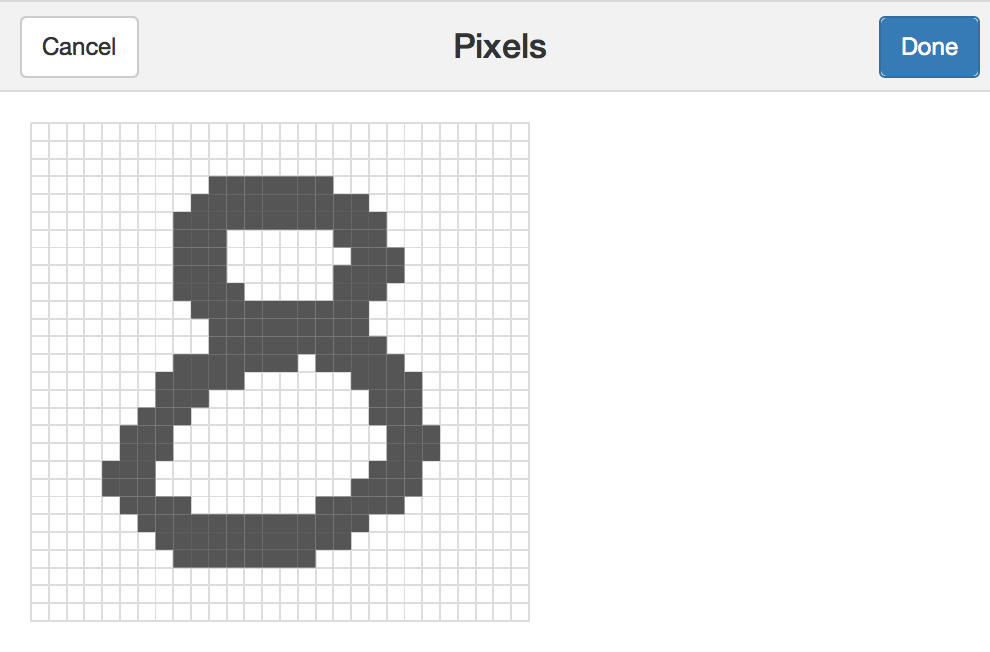

## Getting Started

This package provides an `htmlwidget` and `shinywidget` to collect/draw over
pixels eith ease. For instance, `get_pixel()` starts the shiny gadget to 
retrieve an array of boolean values representing each pixel in the image:

```{r eval=FALSE}
library(pixels)
get_pixels()
```


