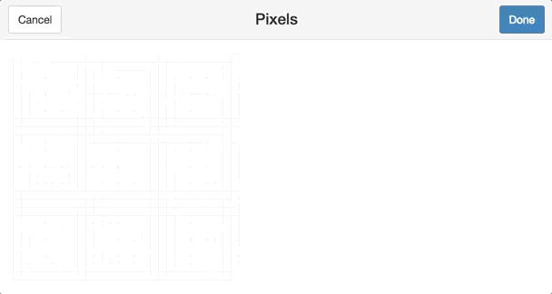
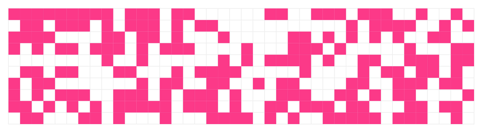
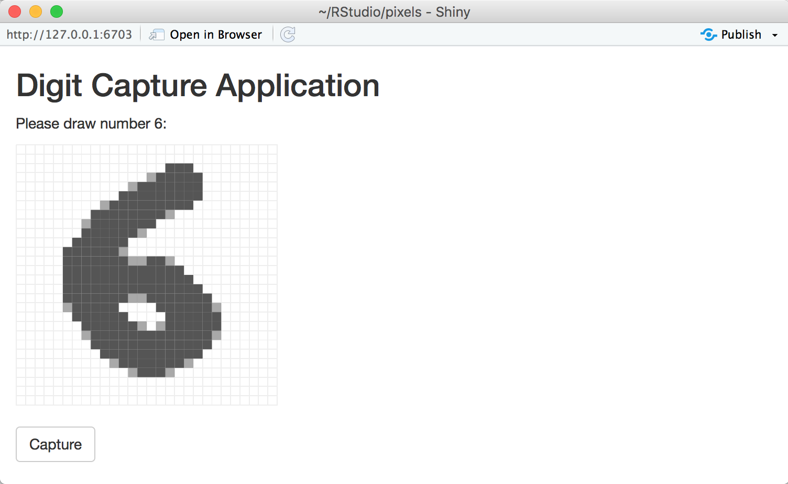

Tools for Working with Pixels in R
================

This package provides an [htmlwidget](http://www.htmlwidgets.org/) and [Shiny Gadget](https://shiny.rstudio.com/articles/gadgets.html) to render and draw pixels with ease.

To draw pixels run `get_pixels()` which will start the gadget to retrieve an array of numeric values representing each pixel in the image:

``` r
library(pixels)
get_pixels()
```



To display pixels, use `show_pixels()` with a row-first vector as follows:

``` r
show_pixels(
  round(runif(400, 0, 1)),
  grid = c(40, 10),
  size = c(800, 200),
  params = list(fill = list(color = "#FF3388"))
)
```



Finally, one can use 'shiny\_render\_pixels()' with a 'Shiny' application to help collect image datasets. For instance, to collect images similar to the MNIST dataset as follows:

``` r
library(shiny)

ui <- fluidPage(
  tags$head(
    tags$style(HTML("
      #pixels {
        height: 270px !important;
        margin-top: 10px;
      }
    "))
  ),
  titlePanel("Digit Capture Application"),
  textOutput("prompt"),
  shiny_pixels_output("pixels"),
  actionButton("captureDigit", "Capture")
)

server <- function(input, output) {
  output$pixels <- shiny_render_pixels(
    show_pixels()
  )
  
  digit <- reactiveVal(floor(runif(1, 1, 10)))
  output$prompt <- renderText(paste0("Please draw number ", digit(), ":"))
  
  observeEvent(input$captureDigit, {
    digit_path <- file.path("digits", digit())
    if (!dir.exists(digit_path)) dir.create(digit_path, recursive = TRUE)
    saveRDS(input$pixels, paste0(digit_path, "/", as.numeric(Sys.time()), ".rds"))
    
    digit(floor(runif(1, 1, 10)))
    output$pixels <- shiny_render_pixels(
      show_pixels()
    )
  })
}

shinyApp(ui = ui, server = server)
```


